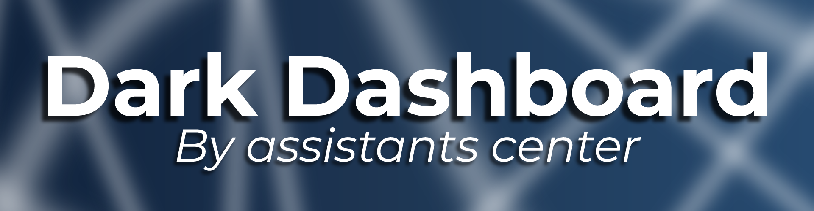

<p align="center"></p>
<p align="center"><a href="https://discord.gg/Nkc8MWxHRD"> </a></p>

# Discord-Dashboard Dark Theme

- Simple Discord-Dashboard theme
- Easy to customize
- Easy configuration
- Community support

# Preview


# Install

```js
npm i dbd-dark-dashboard
```

# Get help

Join our Discord Support Server

<a href="https://discord.gg/Nkc8MWxHRD"> </a>

# Documentation

Full and continuously updated project documentation can be found at the URL: https://assistants.ga/dbd-dark-docs/

# Privacy Policy and Terms of Use

You can always find an updated privacy policy and terms of use for discord-dashboard under URL: https://assistants.ga/discord-dashboard-pp-tos/

# Contact

- **E-mail**: assistants.center@gmail.com, assistants.center.webmaster@gmail.com
- **Discord**: https://discord.gg/Nkc8MWxHRD

# Licenses

The project is covered by a **Shareware (CC BY-NC-SA 4.0) licence**. This means that the project is theoretically free and limited, but it has a paid versions.

### What types of shareware license does the discord-dashboard project fall under?

- **OpenSource License**: Free. Personal usage only. Non-profit.
- **Personal License**: Profit allowed. Personal usage only. Priority support from developers. Limited to major version: v2.*
- **Production License**: Allowed for profit purposes. Distribution Allowed (you can share the license with your close friends). Priority support from developers. Limited to major version: v2.*

#### You always have the latest news and the option to purchase license at the URL: https://licenses.assistants.ga/

<hr>

© 2020-2022 Assistants Center, All rights reserved
